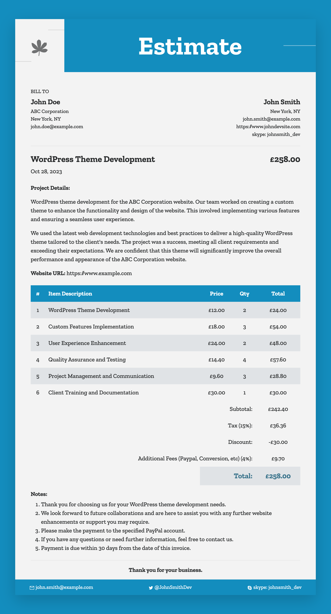

# Estimate Generator CLI

 

The `estimate-generator-cli` is a command-line tool designed to generate images from Markdown files. It simplifies the process by converting Markdown content into an image format.

### Output Sample



## Global Installation

To install the `estimate-generator-cli` globally directly from the GitHub repository, use npm:

```bash
npm install -g https://github.com/vijayhardaha/estimate-generator-cli.git
```

## Usage

The tool provides a command-line interface with the following options:

```bash
generate-estimate [markdown] [--type <type>]
```

### Options

- `markdown`: Path to the Markdown file.
- `-t, --type`: Image type to generate (jpeg or png). Default is `png`.

Example:

```bash
generate-estimate sampleFile.md --type jpeg
```

## Sample File

A sample Markdown file `examples/sample.md` is included in the repository to showcase the expected format and content that the tool processes.

Certainly! Here's an updated Meta Information table that includes the Description and Notes meta items:

#### Meta Information

| Name               | Key            | Description                   | Example                                           |
| ------------------ | -------------- | ----------------------------- | ------------------------------------------------- |
| Client Name        | clientName     | Name of the client            | John Doe                                          |
| Client Company     | clientCompany  | Client's company name         | ABC Corporation                                   |
| Client Location    | clientLocation | Location of the client        | New York, NY                                      |
| Client Email       | clientEmail    | Client's email                | john.doe@example.com                              |
| Developer Name     | devName        | Developer's name              | John Smith                                        |
| Developer Email    | devEmail       | Developer's email             | john.smith@example.com                            |
| Developer Skype    | devSkype       | Developer's Skype ID          | [skype:johnsmith_dev](skype:johnsmith_dev)        |
| Developer Twitter  | devTwitter     | Developer's Twitter handle    | [@JohnSmithDev](https://twitter.com/JohnSmithDev) |
| Developer Website  | devWebsite     | Developer's website           | [John Dev Site](https://www.johndevsite.com)      |
| Developer Location | devLocation    | Developer's location          | New York, NY                                      |
| Service Tax        | serviceTax     | Service tax percentage        | 20%                                               |
| Tax                | tax            | Tax percentage                | 15%                                               |
| Other Fee          | otherFee       | Other fee percentage          | 4%                                                |
| Discount           | discount       | Discount amount               | 30.00                                             |
| Currency           | currency       | Currency type                 | GBP                                               |
| Title              | title          | Project title                 | WordPress Theme Development                       |
| Date               | date           | Date                          | 2023-10-28                                        |
| Description        | description    | Project details and summary   | See example in Markdown file                      |
| Notes              | notes          | Additional notes and comments | See example in Markdown file                      |

#### Invoice Table Columns

| Column Name | Description          | Example                     |
| ----------- | -------------------- | --------------------------- |
| Item        | Description of item  | WordPress Theme Development |
| Price       | Price of the item    | 10.00                       |
| Qty         | Quantity of the item | 2                           |

This table clarifies the structure of the columns within the invoice table. Adjust the descriptions and examples as needed to match the specific details of your invoice table.

## Contributing

Contributions are welcome! If you encounter any issues or have suggestions for improvements, please open an issue or create a pull request in the [repository](https://github.com/vijayhardaha/estimate-generator-cli).

## License

This project is licensed under the MIT License. See the [LICENSE](./LICENSE) file for details.

## Author

[Vijay Hardaha](https://twitter.com/vijayhardaha)
